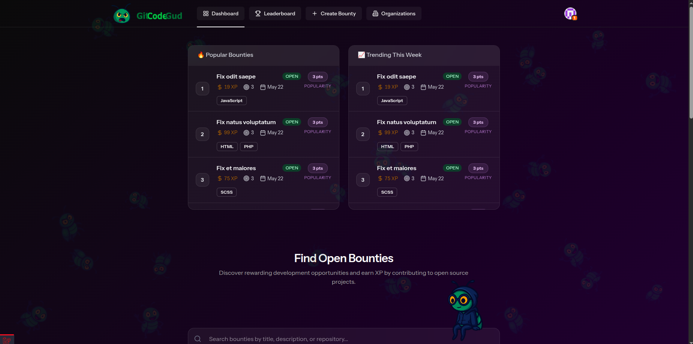
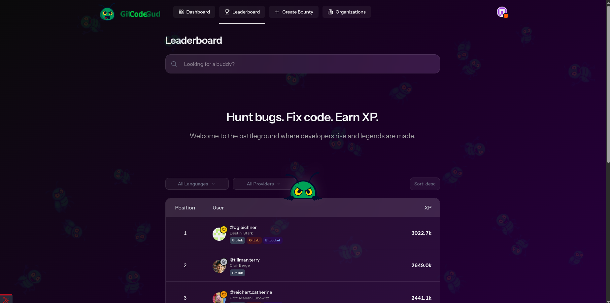
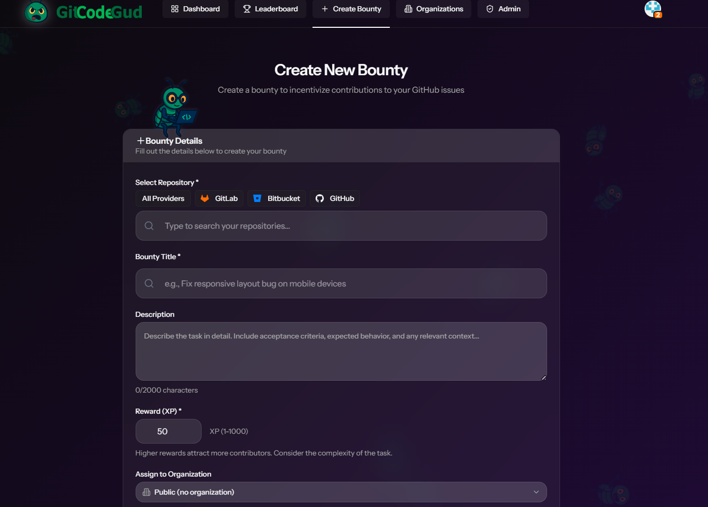
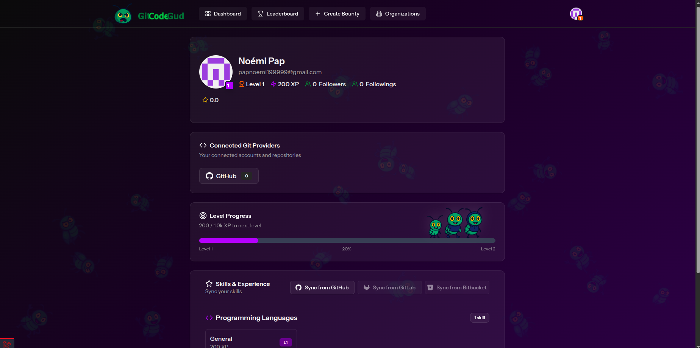

# GitCodeGud

Gamified collaborative platform for software developers built to help programmers gain real-world experience by solving issues and contributing to open-source projects.

GitCodeGud connects GitHub, GitLab and Bitbucket repositories with a bounty-based system where developers can complete tasks, submit merge requests and earn XP through community-driven collaboration.

---

## Application Preview







---

## Features

- OAuth2 authentication with Laravel Socialite (GitHub, GitLab, Bitbucket)
- Repository synchronization from external Git providers
- Bounty-based issue system
- XP and leaderboard system
- Pull request / merge request submission flow
- Repository and issue discovery
- User profiles and follower system
- Review and feedback system
- Organization support
- Search, filtering and sorting for bounties
- Responsive modern frontend

---

## How It Works

1. Users authenticate using OAuth2 with GitHub, GitLab or Bitbucket
2. External repositories are synchronized into the platform
3. Repository owners create bounties for issues
4. Developers claim bounties and submit pull requests or merge requests
5. Accepted contributions reward users with XP
6. XP contributes to the global leaderboard and developer progression system


---

## My Contributions

My main contributions to the project included:

- OAuth integration
- GitLab repository synchronization
- Leaderboard implementation
- Followers system
- Reviews system
- Frontend implementation and UI improvements


## Tech Stack

| Layer | Technology |
|---|---|
| Backend | Laravel |
| Frontend | Vue.js / React |
| Authentication | Laravel Socialite (OAuth2) |
| Database | PostgreSQL |
| APIs | GitHub API, GitLab API, Bitbucket API |

---


## Running Locally

```bash
# Install dependencies
composer install
npm install

# Prepare database
php artisan migrate

# Run app
composer run dev
```
